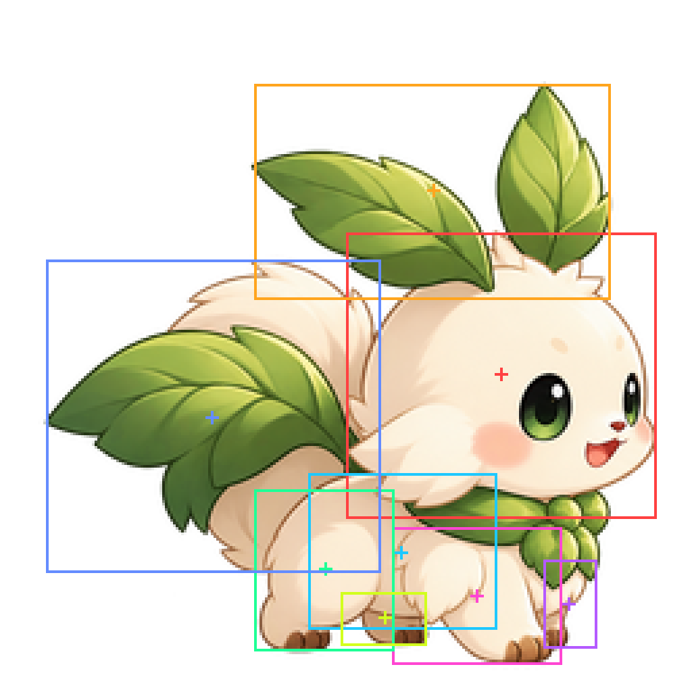

# Production MOA anatomy measurement — MOVE v2 preparation

**Measurement/evidence only. MOVE v1 remains a pipeline/registration pilot, without production visual approval.** No source art, runtime or timing changes.

## Coordinates and limits

Canvas 256×256; origin top-left; x increases rightward and y downward. All min/max values are **inclusive**. Centers are bounding-box midpoints, not mass centers. The main table uses alpha≥128 to exclude faint antialiasing fringe; `measurements.json` also includes alpha>0 bounds.

Anatomical identity cannot be uniquely segmented from this flattened, occluded image. Polygons were annotated by inspecting the actual 4× nearest-neighbor pixel grid and visible seams, then intersected with decoded source alpha. Numbers are exact for these explicitly recorded annotations, **not automatically discovered, anatomically authoritative masks**. Near/far describes visible overlap; anatomical left/right is not recoverable confidently. Far limbs and the body/leg seam have lower confidence. Bounding rectangles overlap and must not be used as unmasked warp/erase regions.

HEAD_FACE excludes leaf crown; HEAD_WITH_CROWN includes it. BODY_VISIBLE covers the visible torso envelope, with occlusion by adjacent limbs/collar; it is not the deformation-safe mask. TAIL includes the curled cream tail and attached tail leaves, not the crown or neck collar.

## Bounds

| Region | x_min | y_min | x_max | y_max | center_x | center_y |
|---|---:|---:|---:|---:|---:|---:|
| HEAD_FACE | 128 | 86 | 242 | 191 | 185.0 | 138.5 |
| HEAD_CROWN | 94 | 31 | 225 | 110 | 159.5 | 70.5 |
| BODY_VISIBLE | 114 | 175 | 183 | 232 | 148.5 | 203.5 |
| FRONT_LEG_NEAR | 145 | 195 | 207 | 245 | 176.0 | 220.0 |
| FRONT_LEG_FAR | 201 | 207 | 220 | 239 | 210.5 | 223.0 |
| REAR_LEG_NEAR | 94 | 181 | 145 | 240 | 119.5 | 210.5 |
| REAR_LEG_FAR | 126 | 219 | 157 | 238 | 141.5 | 228.5 |
| TAIL | 17 | 96 | 140 | 211 | 78.5 | 153.5 |
| HEAD_WITH_CROWN | 94 | 31 | 242 | 191 | 168.0 | 111.0 |
| FRONT_PAW_NEAR | 166 | 229 | 207 | 245 | 186.5 | 237.0 |
| FRONT_PAW_FAR | 205 | 222 | 213 | 238 | 209.0 | 230.0 |
| REAR_PAW_NEAR | 96 | 225 | 126 | 240 | 111.0 | 232.5 |
| REAR_PAW_FAR | 134 | 230 | 157 | 238 | 145.5 | 234.0 |

## Actual ground pixels

The image contains no drawn ground plane. These are **silhouette support rows**, not a claim that all four paws touch one physical plane. The large near-front paw supplies the global lowest pixels; each other paw is drawn higher.

| Alpha threshold | Lowest pixel row y | Inclusive x range(s) |
|---|---:|---|
| ≥1 | 247 | [[181, 199]] |
| ≥128 | 245 | [[186, 195]] |
| ≥250 | 244 | [[183, 197]] |

**Registration baseline:** last nonzero-alpha row y=247, x=181..199; exclusive image-bottom edge y=248. Its box is (181,247)..(199,247), center(190,247). **Visible-core contact:** y=245, x=186..195; center(190.5,245). These are distinct thresholds, not two interchangeable acceptance criteria.

| Paw local visible support (alpha≥128) | y | x runs |
|---|---:|---|
| FRONT_PAW_NEAR | 245 | [[186, 195]] |
| FRONT_PAW_FAR | 238 | [[205, 208]] |
| REAR_PAW_NEAR | 240 | [[103, 117]] |
| REAR_PAW_FAR | 238 | [[142, 154]] |

## Safe deformation proposals

These are deliberately conservative **interior edit proposals**, not new artwork or approved motion amplitudes. Use the recorded polygons, not their rectangular envelopes. Retain original pixels outside the intended semantic mask; hold face, eyes, leaf crown, tail and collar fixed when testing isolated body/paw changes. Body core does not authorize moving the entire torso bbox.

| Interior proposal | x_min | y_min | x_max | y_max | center_x | center_y |
|---|---:|---:|---:|---:|---:|---:|
| BODY_INTERIOR | 136 | 190 | 152 | 219 | 144.0 | 204.5 |
| FRONT_PAW_NEAR_INTERIOR | 176 | 232 | 196 | 240 | 186.0 | 236.0 |
| FRONT_PAW_FAR_INTERIOR | 207 | 224 | 209 | 230 | 208.0 | 227.0 |
| REAR_PAW_NEAR_INTERIOR | 100 | 227 | 119 | 236 | 109.5 | 231.5 |
| REAR_PAW_FAR_INTERIOR | 138 | 232 | 151 | 236 | 144.5 | 234.0 |

For actual leg swing, use the FRONT/REAR_LEG polygons as the **initial layer-extraction review area**, and the paw ROI as the distal articulation area. A flattened image provides no hidden torso pixels behind a lifted foot: direct rectangular translation is **not safe** and can create holes or seams. Reconstruct/layer that occlusion in the next artwork authoring step only after human review. No maximum safe displacement can be established from this single image alone.

For a planted foot, keep its support row and the global registration anchor fixed. A lifted foot may move upward within its reviewed leg mask; do not add pixels below y=247 or translate the whole canvas. Recompute center/bottom drift per delivered frame. Do not infer approved scale/timing/amplitude from this measurement.

## Overlays and reproducibility

Only QA artifacts were generated. Boxes and center crosses are drawn over decoded original pixels; the white dashed row is y=247. Colors map to the entries in `overlay-legend.json` in this order:

- Anatomy: red HEAD_FACE; orange HEAD_CROWN; cyan BODY_VISIBLE; magenta FRONT_LEG_NEAR; purple FRONT_LEG_FAR; green REAR_LEG_NEAR; yellow REAR_LEG_FAR; blue TAIL.
- Paw/safe overlays have independent palettes in the JSON legend. Their boxes are envelopes, not literal editable masks.

`pixel-grid.png` is a QA-only 4× nearest-neighbor view, with grid spacing16 original pixels. `measure.py` computes JSON and 256px overlays from the unchanged source. Run `python3 docs/evidence/moa-move-anatomy/measure.py`; no external imaging dependency is needed. The original files in public/assets are never overwritten.

Source SHA256: `3e2f8a31d71bda3005a0a78eb31ac1ac84a146add959034fdcea3f5c1b765743`.

Validation: regenerated measurement JSON/overlays are deterministic; original production SHA is preserved; changes are confined to this docs/evidence directory. No runtime tests/build/GUI replay is claimed for this anatomy-only documentation task. Historical MOVE evidence remains unchanged. PR #47 stays Draft; no merge.
